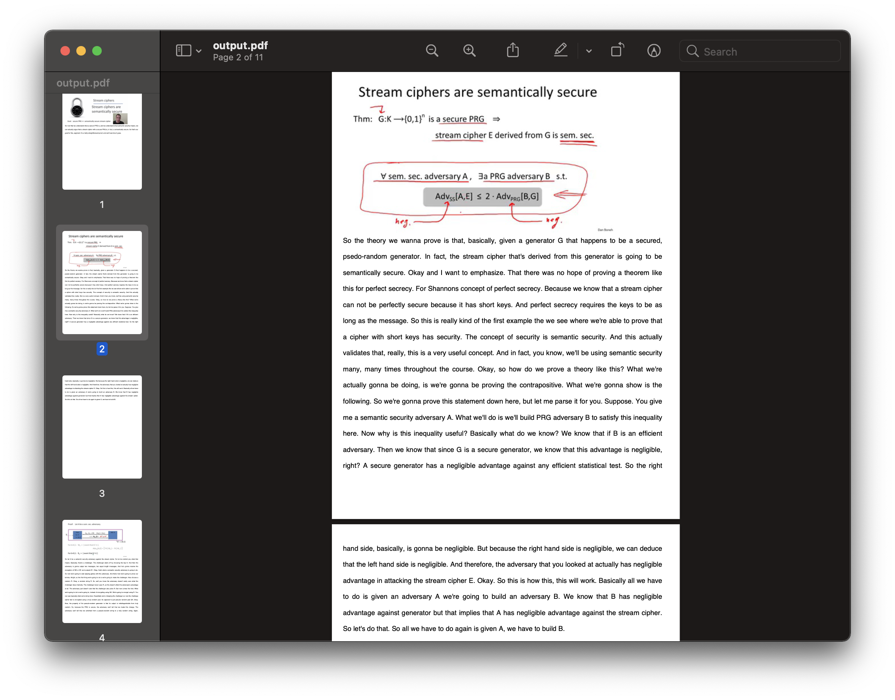

# Convert Lecture Videos to PDF

### Description
Want to go through lecture videos faster without missing any information? Wish you can **read** the lecture video instead of watching it? Now you can! With this python application, you can convert lecture videos to a PDF file! The PDF file will contain a screenshot of lecture slides presented in the video, along with a transcription of your instructor explaining those lecture slide. It can also handle instructors making annotations on their lecture slides and mild amounts of PowerPoint animations.

### Table of Contents
- Walkthrough
- Getting Started
- Next steps
- Usage
- Credits
- License

### Walkthrough of this project
Users will need to download a video file of their lecture. For instance, the video file might look like this:

<div width="100%">
    <p align="center">

    </p>
</div>

Users will also need a copy of the video's subtitles.

After running the command line tool, they will get a PDF that looks like this:

<div width="100%">
    <p align="center">

    </p>
</div>

where each page contains an image of the lecture video, and a transcription explaining about that slide.


### Getting Started
1. Ensure Python3 and Pip is installed on your machine
2. Next, install package dependencies by running:
    
    ```pip3 install -r requirements.txt```

3. Now, run:
   
    ```python3 src/main.py tests/videos/input_1.mp4 -s tests/subtitles/subtitles_1.vtt -o output.pdf```

    to generate a PDF of [this lecture video](tests/videos/input_1.mp4) with [these subtitles](```tests/subtitles/subtitles_1.vtt```)

4. The generated PDF will be saved as *output.pdf*
    
### Next Steps
- [ ] Automatically generate subtitles
- [ ] Wrap project into a web app?

### Usage
Please note that this project is used for educational purposes and is not intended to be used commercially. We are not liable for any damages/changes done by this project.

### Credits
Emilio Kartono, who made the entire project.

### License
This project is protected under the GNU licence. Please refer to the LICENSE.txt for more information.